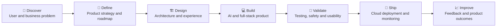

<!--
  GitHub Profile README for Maqadas Manzoor Ahmed
  Replace every occurrence of YOUR_GITHUB_USERNAME and the project URL placeholders.
-->

 

---

## 👋 About Me

I am an **AI Product Engineer and independent founder** who builds user-facing AI products from opportunity discovery and product strategy through architecture, development, testing, and production deployment.

My work combines **hands-on engineering**, **product judgement**, and a strong focus on business impact. I specialise in translating emerging AI capabilities into reliable, intuitive, and scalable customer experiences.

- 🧠 Building with **Generative AI, LLMs, RAG, embeddings, and conversational AI**
- 🚀 Taking products from **zero-to-one**, including roadmap, architecture, UX, testing, and launch
- 🏗️ Developing **multi-tenant SaaS platforms**, secure APIs, and cloud workflows
- 🎯 Focused on AI products that solve real customer and operational problems
- 📍 Based in **London, UK**, with full right to work in the UK
- 🤝 Open to **AI Product Engineer, Full-Stack AI, and Product Engineering** opportunities

---

## 🧩 What I Bring

<table>
<tr>
<td width="33%" valign="top">

### 🤖 AI Engineering
- LLM integration
- Retrieval-Augmented Generation
- Embeddings and semantic search
- Prompt engineering
- Conversational AI
- Agentic AI concepts
- TensorFlow and CNNs

</td>
<td width="33%" valign="top">

### ⚙️ Product Engineering
- React and Next.js
- TypeScript and JavaScript
- Node.js and Express
- REST APIs
- MongoDB and SQL
- Embeddable web components
- End-to-end testing

</td>
<td width="33%" valign="top">

### 🧭 Product Leadership
- Product strategy
- Roadmap ownership
- Zero-to-one delivery
- Technical decision-making
- User-centred design
- Stakeholder communication
- Execution in ambiguity

</td>
</tr>
</table>

---

## 🛠️ Technology Stack

### Core Engineering

### AI, Data and Cloud

 

---

## 🌟 Featured Projects

### 1. AI Customer Support SaaS Platform

> A multi-tenant AI support platform combining autonomous assistance, grounded knowledge retrieval, live-agent handover, business workflows, and billing.

**Highlights**

- Defined the product vision, roadmap, user experience, and technical architecture
- Built the complete platform independently with **Next.js 14, React, and TypeScript**
- Designed a **RAG pipeline** using embeddings and client-owned content
- Integrated **Claude and OpenAI GPT** behind reusable service abstractions
- Developed an embeddable **Shadow DOM chat widget**
- Implemented real-time AI-to-human takeover and WhatsApp Business integration
- Added Stripe billing and Playwright end-to-end tests
- Designed a multi-tenant architecture that securely isolates customer data

**Stack:** `Next.js` `React` `TypeScript` `Claude` `OpenAI GPT` `RAG` `MongoDB` `Stripe` `Playwright`

---

### 2. AI-Powered Clinical Web Application

> An end-to-end AI application for diabetic retinopathy detection, connecting deep-learning model evaluation with a practical clinical workflow.

**Highlights**

- Benchmarked **ResNet50, EfficientNetB0, and MobileNetV2**
- Integrated trained models into a complete React and Node.js experience
- Balanced model performance, usability, deployment, and responsible diagnostic positioning
- Translated technical model outputs into a clear user-facing workflow

**Stack:** `React` `Node.js` `MongoDB` `Python` `TensorFlow` `ResNet50` `EfficientNetB0` `MobileNetV2`

---

### 3. Real Estate CRM and API Platform

> A production CRM and integration platform supporting Admin, Landlord, and Tenant workflows.

**Highlights**

- Architected more than **60 REST endpoints**
- Built role-based access across three dedicated portals
- Integrated Facebook lead capture, Google Ads webhooks, Rightmove RTDF, and Zoopla XML feeds
- Developed a canvas-based e-signature workflow with a complete audit trail
- Deployed through VPS, Nginx, and SSL

**Stack:** `Node.js` `Express.js` `MongoDB` `REST APIs` `Facebook Graph API` `Nginx`

---

## 🧠 How I Build Products

---

## 🎓 Education and Certifications

- **MSc Artificial Intelligence & Robotics** — University of Hertfordshire
- **BSc Software Engineering** — Virtual University of Pakistan
- **Generative & Agentic AI** — University of Oxford
- **AI Engineer** — AI NexGen USA
- **IBM Cloud Computing**

---

## 📊 GitHub Overview

 

 

> GitHub widgets become accurate after replacing `YOUR_GITHUB_USERNAME` with your real username.

---

## 🤝 Let’s Build Something Valuable

I am interested in opportunities where AI, product thinking, and full-stack engineering come together to create useful customer experiences.

  

 

### ⭐ Explore my repositories and follow my journey building production-ready AI products.

